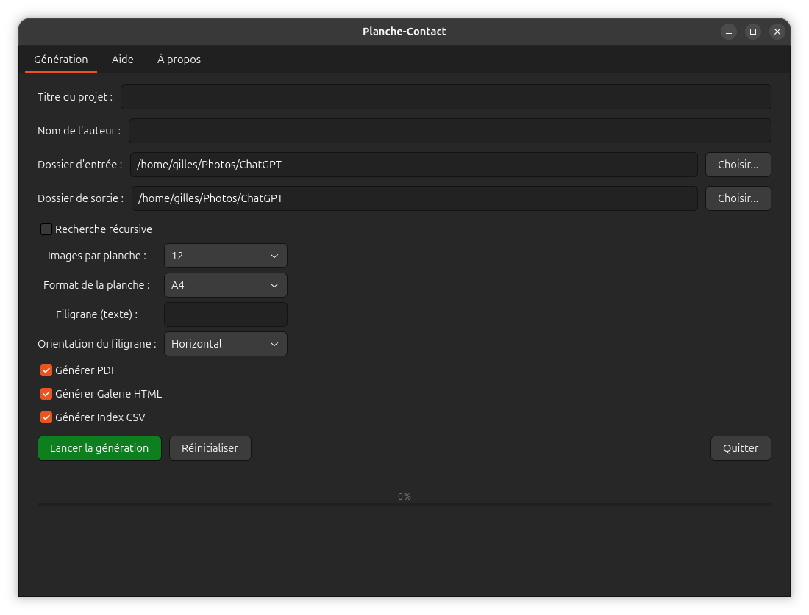
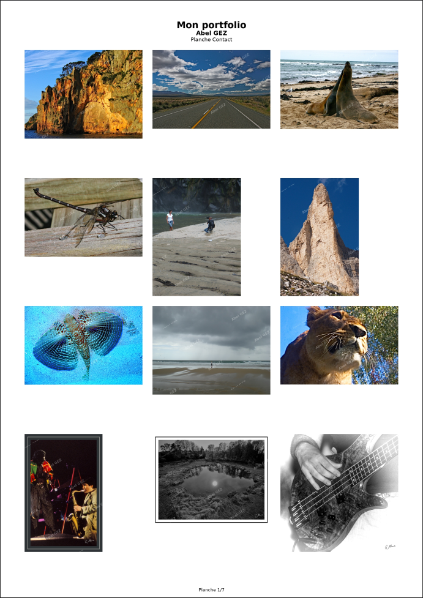
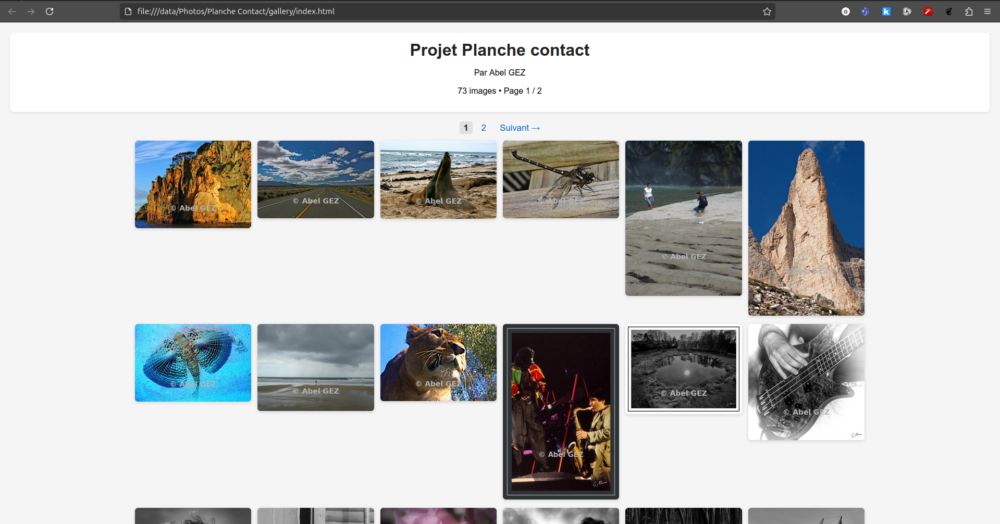
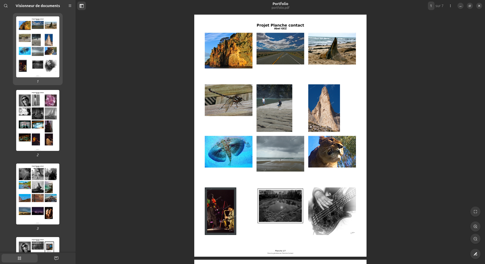

<p align="center">
  
</p>

<h1 align="center">Planche-Contact Linux</h1>

<p align="center">
<strong>Professional Contact Sheets from JPEG and RAW Images</strong>
</p>

<p align="center">


</p>

<p align="center">


</p>

<p align="center">

Create professional-quality contact sheets directly from JPEG and RAW image folders.

Generate high-resolution contact sheets, PDF documents, responsive HTML galleries and CSV indexes — **without any database, catalog or image import**.

</p>

---

<p align="center">

</p>

---

# Contents

- [Why Planche-Contact?](#why-planche-contact)
- [Workflow Comparison](#workflow-comparison)
- [Example Output](#example-output)
- [Supported RAW Formats](#supported-raw-formats)
- [Installation](#installation)
- [Build from Source](#build-from-source)
- [Documentation](#documentation)
- [Roadmap](#roadmap)
- [Contributing](#contributing)
- [License](#license)

---

# Why Planche-Contact?

Planche-Contact is designed to generate professional photographic contact sheets quickly and simply.

Unlike Digital Asset Management (DAM) applications, it does not require importing images into a catalog or maintaining a database. It works directly from existing folders and immediately generates high-quality contact sheets, PDF documents, responsive HTML galleries and CSV indexes.

Ideal for photographers, museums, archives, studios and image collections.

---

# Workflow Comparison

| Capability | Planche-Contact | Catalog-based Workflow |
|:-----------|:---------------:|:----------------------:|
| Database required | ❌ | ✅ |
| Image import | ❌ | ✅ |
| Catalog management | ❌ | ✅ |
| Direct folder processing | ✅ | ⚠️ |
| JPEG support | ✅ | ✅ |
| RAW support | ✅ | ✅ |
| 300 dpi contact sheets | ✅ | ⚠️ |
| PDF export | ✅ | ⚠️ |
| Responsive HTML gallery | ✅ | ⚠️ |
| CSV index export | ✅ | ❌ |
| Lightweight workflow | ✅ | ❌ |
| Free & Open Source (GPL v3) | ✅ | varies |

---

# Example Output

<table>
<tr>

<td align="center" width="50%">

<b>Generated Contact Sheet</b><br><br>



</td>

<td align="center" width="50%">

<b>Responsive HTML Gallery</b><br><br>



</td>

</tr>

<tr>

<td align="center">

<b>Generated PDF</b><br><br>



</td>

<td align="center">

<b>Main Window</b><br><br>


</td>

</tr>
</table>

---

# Supported RAW Formats

Planche-Contact supports RAW files through **LibRaw**, ensuring compatibility with cameras from most major manufacturers.

| Canon | Nikon | Sony | Fujifilm |
|-------|--------|-------|-----------|
| Panasonic | Olympus / OM System | Pentax | Leica |
| Hasselblad | Sigma | Phase One | and many more... |

---

# Installation

Download the latest **.deb** package from the **Releases** page.

```bash
sudo apt install ./planche-contact_<version>_amd64.deb
```

---

# Build from Source

Clone the repository.

```bash
git clone https://github.com/gillesmagneville/planche-contact-Linux.git
```

Enter the project directory.

```bash
cd planche-contact-Linux
```

Install the required dependencies.

Run the application.

---

# Documentation

| File | Description |
|------|-------------|
| README.md | Project overview |
| CHANGELOG.md | Release history |
| CONTRIBUTING.md | Contribution guidelines |
| CODE_OF_CONDUCT.md | Community rules |
| LICENSE | GNU GPL v3 |

---

# Roadmap

- Windows version
- Internationalization (i18n)
- Custom contact sheet templates
- Additional export formats
- Improved PDF customization

---

# Contributing

Contributions are welcome.

Whether you want to report a bug, suggest a feature, improve the documentation or submit code, your help is appreciated.

Please read **CONTRIBUTING.md** before opening an Issue or a Pull Request.

---

# License

Planche-Contact Linux is distributed under the terms of the **GNU General Public License v3.0**.

---

<p align="center">

⭐ <strong>If Planche-Contact is useful to you, please consider giving the project a Star.</strong>

</p>
